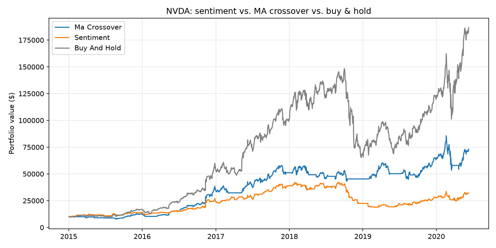
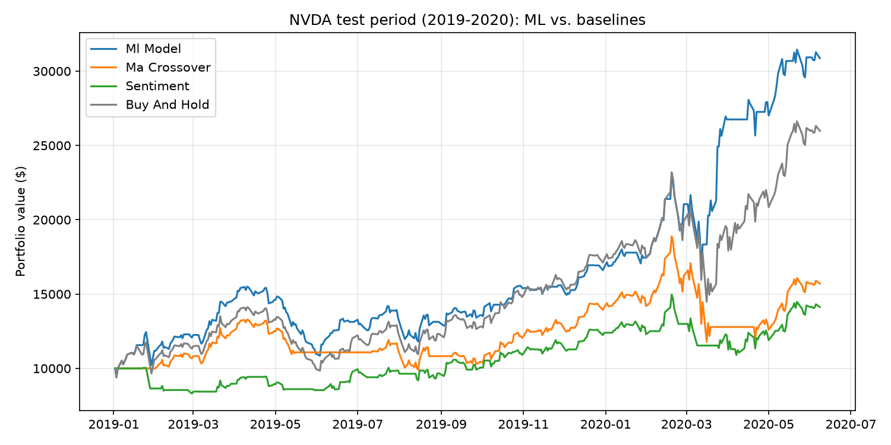

# AI News-Sentiment Trader

Can the sentiment of financial news headlines drive a better trading strategy than a simple technical rule, or than just buying and holding? This project scores thousands of headlines with **FinBERT**, a language model built for financial text, turns the scores into buy/sell signals, and backtests them on NVIDIA (NVDA) from 2015 to 2020. A second phase combines sentiment with price features in a logistic regression model, trained on 2015–2018 and tested on unseen 2019–2020 data.



## Results

$10,000 starting capital, NVDA, Jan 2, 2015 – Jun 9, 2020 (1,368 trading days):

| Strategy | Total return | Max drawdown | Final value | Time invested | Position changes |
| --- | --- | --- | --- | --- | --- |
| Buy & hold | **+1,766.5%** | -56.0% | $186,647 | 100% | 0 |
| 20/50-day MA crossover | +630.7% | **-37.6%** | $73,070 | 69.5% | 25 |
| News sentiment (FinBERT) | +217.6% | -55.8% | $31,759 | 59.9% | 218 |

### What the results show

- **Buy-and-hold wins.** NVDA grew about 18x over this period. Any strategy that spends time in cash misses some of the biggest up days, and on a stock like this that is very costly.
- **The moving-average rule traded return for safety.** It cut the worst drawdown from -56% to -38%. During the late-2018 crash (Sep 2018 – Jan 2019) it lost 13%, while buy-and-hold lost 49%.
- **Sentiment underperformed on both measures.** It lost 54% in the same crash window, worse than simply holding. A likely reason: many headlines describe moves that have already happened (*"NVIDIA shares are trading down 2.9% after..."*), so sentiment turns negative *after* the drop. The strategy sells near the bottom and misses the rebound. It also switched positions 218 times, about 9x as often as the MA rule.

**Takeaway:** averaged daily headline sentiment on its own was not a useful timing signal for NVDA in this period. Phase 3 below tests whether it adds value when *combined* with price-based features in a trained model.

## Phase 3: Machine-learning model

A logistic regression model predicts whether NVDA will close higher tomorrow, using information available at today's close. When it predicts "up", the strategy holds the stock the next day; otherwise it holds cash.



### Setup

- **Label:** 1 if tomorrow's close is above today's, otherwise 0.
- **Features (8):** 1-, 5- and 20-day returns; price relative to its 20-day average; 20-day volatility; daily FinBERT sentiment; 5-day average sentiment; number of headlines.
- **Time-based split, never shuffled:**

  | Period | Dates | Used for |
  | --- | --- | --- |
  | Train | 2015 – 2017 | fitting candidate models |
  | Validation | 2018 | choosing between models |
  | Test | 2019 – Jun 2020 | final result, evaluated once |

  The last day of each period is dropped, because its label depends on the first day of the next period.
- **Model choice:** logistic regression and a random forest were compared on 2018. Both predicted "up" on more than 98% of days and neither clearly beat the "always up" baseline (50.4%), so the simpler model was kept. It was then retrained on 2015–2018 and run on the test period once. Nothing was changed after seeing the test results.

### Test-period results

$10,000 starting capital, NVDA, Jan 2, 2019 – Jun 8, 2020 (361 trading days):

| Strategy | Total return | Max drawdown | Final value |
| --- | --- | --- | --- |
| ML model (logistic regression) | **+208.7%** | -30.0% | $30,873 |
| Buy & hold | +159.8% | -37.6% | $25,984 |
| 20/50-day MA crossover | +57.0% | -37.6% | $15,697 |
| News sentiment (FinBERT) | +41.3% | **-27.2%** | $14,130 |

| Classification | Value |
| --- | --- |
| Test accuracy | 57.3% |
| "Always up" baseline | 55.1% |
| Days predicted up | 78.4% |

### What the results show

- **The model beat buy-and-hold on this test period**, with a higher return and a smaller drawdown. The days it sat in cash averaged -0.13%, against +0.33% for an average day, so its "down" calls did land on worse-than-average days.
- **The accuracy edge is not statistically significant.** 57.3% vs. 55.1% is about 8 more correct days out of 361, well within what chance alone could produce.
- **The outperformance depends on a few days.** Three days in cash during the March–April 2020 COVID crash account for most of the lead, including Mar 16, 2020 (-18.5%). If the model had held on those three days, its return would have been +116.7%, below buy-and-hold. It also missed some large up days, such as +10.0% on Apr 6, 2020.

**Takeaway:** the result is promising but not strong evidence of a reliable edge. One crash in one test period is too little to tell whether the model would step aside again next time. A longer test period, more stocks, and transaction costs would be needed to say more.

## How it works

```
Prices (Yahoo Finance) ──────────────────────────┐
                                                 ├─► Strategy signals ─► Backtest ─► Results + chart
News headlines (Kaggle) ─► FinBERT sentiment ────┘
```

1. **Prices.** Daily split- and dividend-adjusted prices are downloaded with `yfinance` and cached locally.
2. **News.** 2,472 NVDA headlines covering 841 trading days are loaded from a public Kaggle dataset. Each headline is assigned to the first trading day it could have affected (see below).
3. **Sentiment.** Every headline is scored with [FinBERT](https://huggingface.co/ProsusAI/finbert) as `P(positive) - P(negative)`, a number from -1 to +1. Scores are averaged into one value per day and cached, so scoring only runs once.
4. **Strategies.**
   - *MA crossover:* hold the stock when the 20-day moving average is above the 50-day, otherwise hold cash.
   - *Sentiment:* hold the stock when the 5-day average sentiment is above 0. Days with no news count as neutral.
5. **Backtest.** Each strategy is either fully invested or fully in cash. Daily returns are compounded and compared against buy-and-hold.
6. **ML model (Phase 3).** Price features and sentiment features are joined into one table with a next-day up/down label. A logistic regression model is trained on earlier years, and its daily "up" predictions become a hold-or-cash signal that runs through the same backtest.

## Avoiding look-ahead bias

A backtest is only meaningful if it never uses information that wasn't available yet. These are the decisions I made to prevent that:

- **Trade the next day.** A signal calculated from a day's closing price can't be acted on until the following day, so every signal is shifted forward one day before it is applied.
- **Headline timing.** Timestamps are converted to New York market time. A headline published at or after 4:00 PM (market close) counts toward the next trading day, and weekend or holiday headlines roll forward to the next day the market is open.
- **Headlines with no time.** Over 99% of the NVDA headlines in the dataset have a date but no publish time. These are conservatively treated as published *after* the close and assigned to the next trading day. In the worst case the strategy reacts a day late, but it never trades on news before it existed.
- **Model knowledge.** I used FinBERT instead of a modern general-purpose LLM. A recent LLM may have read about how NVDA actually performed from 2015 to 2020, which could leak future knowledge into the sentiment scores. FinBERT's financial training data (Reuters news from 2008–2010 and the Financial PhraseBank) gives it much less of that knowledge.
- **No tuning on the test period.** The strategy settings (20/50-day windows, 5-day sentiment average, threshold of 0) were chosen up front and were not adjusted after seeing these results.
- **Time-based split for the model.** The ML data is split by date (train 2015–2017, validate 2018, test 2019–2020) and never shuffled, so the model is always tested on years after the ones it learned from. The last day of each period is dropped so no label reaches into the next period. Every feature for a day uses only data available by that day's close, and the test set was used once, after the model was chosen.

## Limitations

- One stock over one period. NVDA's exceptional run makes buy-and-hold especially hard to beat.
- No transaction costs or slippage. Including them would hurt the sentiment strategy most, since it trades the most often.
- The news data ends in June 2020, and about 39% of trading days have no NVDA headline.
- Many headlines are generic market lists (*"Stocks That Hit 52-Week Highs On Friday"*) or report price moves that already happened, which adds noise.
- Long-or-cash only: no short selling and no partial position sizing.
- The ML model's accuracy edge over "always up" is not statistically significant, and most of its outperformance comes from three days during the COVID crash. It was tested on a single period of about 17 months.

## Project structure

```
.
├── src/
│   ├── data.py         download and cache daily price data
│   ├── news.py         load headlines and align them to trading days
│   ├── sentiment.py    FinBERT scoring and daily averaging (cached)
│   ├── strategy.py     MA crossover and sentiment signals
│   ├── backtest.py     backtest engine, performance metrics, chart
│   ├── features.py     label, features, and time-based split for the ML model
│   ├── model.py        model training and evaluation
│   ├── main.py         runs the full-period strategy comparison
│   └── run_ml.py       trains the ML model and backtests it on the test period
├── results/
│   ├── equity_curve.png
│   └── equity_curve_test.png
└── requirements.txt
```

## Running it

Requires Python 3.

1. Install the dependencies:
   ```
   pip install -r requirements.txt
   ```
2. Download the [Daily Financial News for 6000+ Stocks](https://www.kaggle.com/datasets/miguelaenlle/massive-stock-news-analysis-db-for-nlpbacktests) dataset from Kaggle and place `raw_analyst_ratings.csv` in `data/news/`. The data isn't included in this repo because of its size.
3. From the project's root folder, run:
   ```
   python src/main.py
   ```
4. To train the ML model and backtest it on the test period, run:
   ```
   python src/run_ml.py
   ```

The first run downloads the price data and the FinBERT model (about 400 MB), then scores every headline, which takes a few minutes on a CPU. Later runs use the cached files in `data/` and finish quickly. If you change how headlines are loaded, delete `data/sentiment_NVDA.csv` so they get re-scored.

> **Windows note:** if `pip install torch` fails with *"The filename or extension is too long"*, enable long file paths in Windows and try again.

## Roadmap

- [x] Train a machine-learning model on price features plus sentiment. Train on 2015–2018 and test on 2019–2020, which the model never sees during training.
- [ ] Test the ML model on a longer period and on more stocks.
- [ ] Add transaction costs to the backtest.
- [ ] Filter out generic, market-wide headlines.
- [ ] Support multiple tickers and portfolio-level backtests.
- [ ] Connect a live news API for current data.

## Disclaimer

This is an educational project. All results are simulated backtests on historical data, and nothing here is financial advice.

## Author

**Konrad Miedzialowski**, Computer Science, Marquette University
[LinkedIn](https://www.linkedin.com/in/konrad-miedzialowski-a32b0b1a3) · [GitHub](https://github.com/kmiedzialowski)
